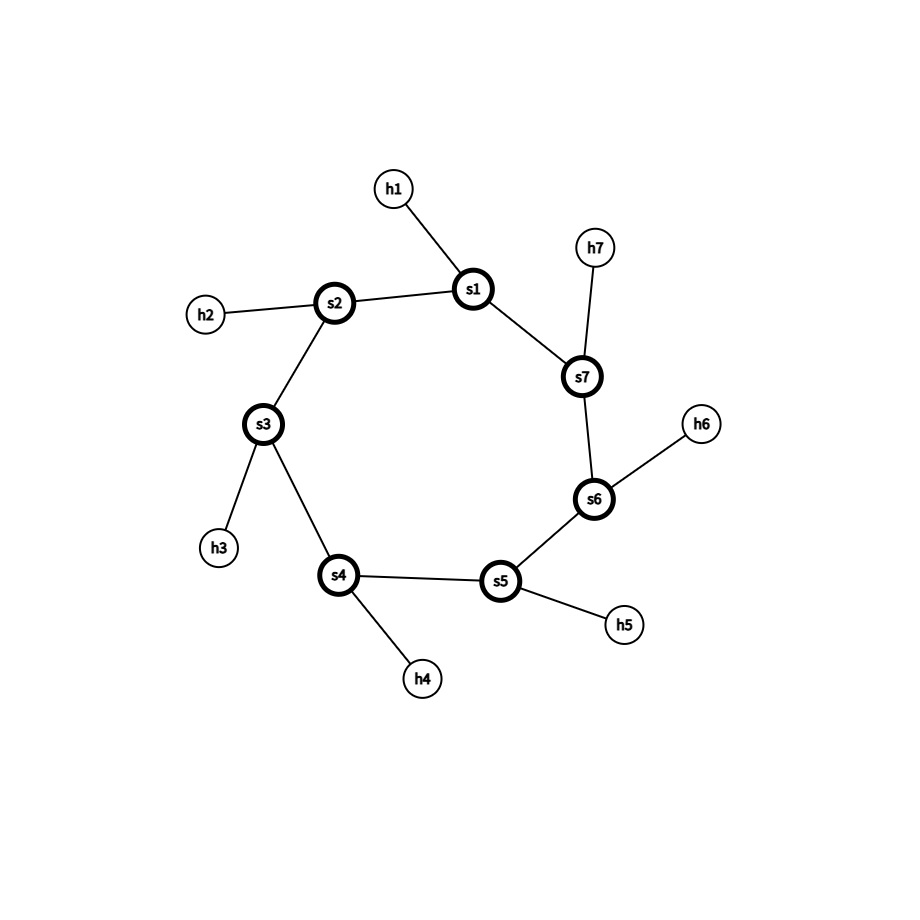

# CS305 项目测试运行手册

两个终端：**终端 1** 跑控制器，**终端 2** 跑 Mininet。

> **项目根目录：** `~/CS305-2026Spring-Project`  
> **运行测试统一命令：**  
> `sudo env "PATH=$PATH" python test_network.py # share the PATN env with sudo user`

---

## 核心约定

| 场景 | 终端 2 | 终端 1 |
|------|--------|--------|
| 换一大项测试 | `exit` → `sudo mn -c` → 新脚本 | **请重启 controller**（见 §1） |
| 同一测试内多次 `link`/`switch` | 可只 `sudo mn -c` 再进 | 可保持运行 |
| 改代码 / 换防火墙规则 | `sudo mn -c` | **请重启 controller** |

**为何换大项要重启 controller？** `sudo mn -c` 不清理控制器内存；连续测试可能导致 h1 显示 `0.0.0.0`、`pingall` 全丢包。换 DHCP / switching / firewall / complex 前请在 **终端 1 重启 controller**。

**Mininet：** 用 `exit` 退出 CLI，勿 Ctrl+Z。  
**防火墙规则：** `firewall.py` 读 `firewall_rules.json`（由 `firewall_rule.json` 或 `firewall_rule_complex.json` 复制而来；**复制后须重启 controller**）。

---

## 1. 演示前初始化（终端 1，按场景选用）

进入项目目录并清理 Mininet 残留：

```bash
conda activate cs305
cd ~/CS305-2026Spring-Project
sudo mn -c
```

### 1.1 通用：防火墙规则与路由算法

```bash
# 删除运行时规则，避免上次 cp 的规则影响本次测试
rm -f firewall_rules.json

# 必修课 / complex / 默认 switching：使用 Dijkstra（二选一）
unset CS305_ROUTING
# export CS305_ROUTING=dijkstra
```

| 场景 | `firewall_rules.json` | `CS305_ROUTING` |
|------|------------------------|-----------------|
| DHCP、Switching 基础 | **不创建**（`rm` 即可） | `unset` 或 `dijkstra` |
| Switching Bonus（多算法） | 不创建 | `bellman-ford` / `bfs` / `networkx` 等 |
| Firewall 基础 | `cp firewall_rule.json firewall_rules.json` | `unset` / `dijkstra` |
| Complex 阶段 A | 不创建 | **必须** `unset` / `dijkstra`（见 §5.1） |
| Complex 阶段 B | `cp firewall_rule_complex.json firewall_rules.json` | `unset` / `dijkstra` |

修改 `firewall_rules.json` 或 `CS305_ROUTING` 后，须 **重新启动** `osken-manager`（见 §1.2）。

### 1.2 启动 controller

```bash
conda activate cs305
cd ~/CS305-2026Spring-Project
sudo mn -c
# 按 §1.1 完成 rm / unset / export / cp 后：
osken-manager --observe-links controller.py
```

启动日志自检：

- 默认路由：`Routing algorithm: dijkstra`
- DHCP 租约演示：`DHCP bonus: lease_time=10s, ...`（`dhcp.py` 中 `lease_time = 10`）

---

## 2. DHCP（含租约 Bonus 演示）

**换本项前：** §1.1 → `rm -f firewall_rules.json` + `unset CS305_ROUTING` → §1.2 重启 controller。

**租约配置：** `dhcp.py` 中 `lease_time = 10`（演示用）；保存后 §1.2 启动 controller。

**终端 2：**

```bash
conda activate cs305
cd ~/CS305-2026Spring-Project/tests/dhcp_test
sudo mn -c
sudo env "PATH=$PATH" python test_network.py # share the PATN env with sudo user
```

脚本会自动 `dhclient`；进入 CLI 后两步演示（**不要用 `pingall`**）。

### 2.1 正常分配

```bash
h1 ifconfig
h2 ifconfig
```

**期望：** IP 在 `192.168.1.2`–`192.168.1.100`（常见 h1→`.2`，h2→`.3`）。

### 2.2 超时回收后重新分配

脚本启动后 h1/h2 已有租约（10 秒）。**尽快**完成 2.1 后：

1. 在 CLI **安静等待约 12～15 秒**（租约 10s + 清理间隔 5s，勿关 controller）。终端 1 应出现 `DHCP leases: ... soonest expires in ...`，随后 `[DHCP CLEAN] ...`。
2. 再执行：

```bash
h1 killall dhclient 2>/dev/null || true
h1 dhclient -v h1-eth0
h1 ifconfig h1-eth0
```

**期望：** 仍能拿到池内合法 IP；终端 1 再次出现 OFFER/ACK。

```bash
exit
```

| 现象 | 处理 |
|------|------|
| 无 `[DHCP CLEAN]` | `lease_time=10` 且已重启 controller；2.1 后等待 ≥12s，勿过早 Ctrl+C |
| 2.1 未完成就出现 CLEAN | 进入 CLI 后先快速 `ifconfig`，再等待 |

---

## 3. Switching 基础（三角形）

**换本项前：** §1.1 → `rm -f firewall_rules.json` + `unset CS305_ROUTING` → §1.2 重启 controller。

**终端 2：**

```bash
conda activate cs305
cd ~/CS305-2026Spring-Project/tests/switching_test
sudo mn -c
sudo env "PATH=$PATH" python test_network.py # share the PATN env with sudo user
```

```bash
pingall
exit
```

**期望：** `pingall` → `0% dropped`。终端 1 路径示例：`h1 -> s1 -> s2 -> h2, distance=3`；主机为 `h1(10.0.0.1)` 而非 `h1(0.0.0.0)`。

链路 up/down 等鲁棒性测试见 **§5 Complex 阶段 A**，基础演示不做。

### 3.1 Bonus：多种最短路径算法（`CS305_ROUTING`）

**终端 1 初始化示例（Bellman-Ford）：**

```bash
conda activate cs305
cd ~/CS305-2026Spring-Project
sudo mn -c
rm -f firewall_rules.json
export CS305_ROUTING=bellman-ford
osken-manager --observe-links controller.py
```

合法取值：`dijkstra`（默认）、`bellman-ford`、`bfs`、`networkx`。启动日志应含 `Routing algorithm: bellman-ford`。

**终端 2：** 与 §3 相同，仅 `pingall`。

**对比演示（两轮）：**

| 轮次 | 终端 1 |
|------|--------|
| A | `export CS305_ROUTING=dijkstra` → 重启 controller |
| B | `export CS305_ROUTING=networkx` → 重启 controller |

每轮：`sudo mn -c` → `switching_test` → `pingall` → 期望 `0% dropped`，路径与 distance 与 Dijkstra 一致。

**Bonus 演示结束后：** `unset CS305_ROUTING` 并重启 controller，再跑 Complex（§5.1）。

---

## 4. Firewall 基础

**换本项前：** §1.1 → `rm -f firewall_rules.json`（可选，再 cp 覆盖）→ `unset CS305_ROUTING` → 加载 basic 规则并重启 controller：

```bash
conda activate cs305
cd ~/CS305-2026Spring-Project
sudo mn -c
rm -f firewall_rules.json
unset CS305_ROUTING
cp firewall_rule.json firewall_rules.json
osken-manager --observe-links controller.py
```

**终端 2：**

```bash
conda activate cs305
cd ~/CS305-2026Spring-Project/tests/firewall_test
sudo mn -c
sudo env "PATH=$PATH" python test_network.py # share the PATN env with sudo user
```

脚本自动测 4 项；或 CLI：

```bash
h1 ping -c 2 192.168.117.3
h1 ping -c 2 192.168.117.4
exit
```

**期望：** h1→h2 失败；h1→h3 成功。

---

## 5. Complex Test

### 5.0 初始拓扑

7 交换机环：`s1 — s2 — s3 — s4 — s5 — s6 — s7 — s1`，`h_i` 仅连 `s_i`（14 节点 / 14 边）。



```text
h1 s1  h2 s2  h3 s3  h4 s4  h5 s5  h6 s6  h7 s7
s1 s2  s2 s3  s3 s4  s4 s5  s5 s6  s6 s7  s7 s1
```

---

### 5.1 阶段 A — Switching（先不测 firewall）

**换本项前：请在终端 1 恢复默认路由并重启 controller**（若刚做过 §3.1 Bonus，务必 `unset CS305_ROUTING`，否则 complex 仍用 bellman-ford 等）：

```bash
conda activate cs305
cd ~/CS305-2026Spring-Project
sudo mn -c
rm -f firewall_rules.json
unset CS305_ROUTING
osken-manager --observe-links controller.py
```

确认启动日志为 `Routing algorithm: dijkstra`。无需 `firewall_rules.json`；旧 basic 规则（192.168.117.x）不匹配 `10.0.0.x`，不影响 pingall。

**终端 2：**

```bash
conda activate cs305
cd ~/CS305-2026Spring-Project/tests/complex_test
sudo mn -c
sudo env "PATH=$PATH" python test_network.py # share the PATN env with sudo user
```

等待 ~11 s 后进 CLI，**整段复制**（仅开头 `pingall` 一次）：

```bash
pingall
link s4 s5 down
link s4 s5 up
sh ovs-ofctl show s1
sh ovs-ofctl mod-port s1 2 down
sh ovs-ofctl mod-port s1 2 up
switch s3 stop
switch s3 start
link h1 s1 down
link h1 s1 up
exit
```

#### 各操作后终端 1 应有输出（对照）

**基线（启动 + arping 完成后）**

```text
Topology (networkx): 14 nodes, 14 edges
s1 to s7: s1 -> s7, 1 edges
h1 to h5: h1 -> s1 -> s7 -> s6 -> s5 -> h5, distance=5
```

`pingall` → `0% dropped` (42/42)

---

**`link s4 s5 down`**

```text
Topology (networkx): 14 nodes, 13 edges    # 少 s4-s5 边
s4 to s5: s4 -> s3 -> s2 -> s1 -> s7 -> s6 -> s5, 6 edges
h4 to h5: h4 -> s4 -> s3 -> s2 -> s1 -> s7 -> s6 -> s5 -> h5, distance=8
s1 to s7: s1 -> s7, 1 edges               # 不变
```

连通仍正常（绕环）；不必再 pingall。

---

**`link s4 s5 up`**

路径恢复为基线（`s4 to s5: s4 -> s5, 1 edges`，14 edges）。

---

**`sh ovs-ofctl mod-port s1 2 down`**（断 s1–s2 端口）

```text
s1 to s2: s1 -> s7 -> s6 -> s5 -> s4 -> s3 -> s2, 6 edges   # 原 1 edge
h1 to h2: h1 -> s1 -> s7 -> ... -> s2 -> h2, distance=8
```

其余 host 对仍可达。

---

**`sh ovs-ofctl mod-port s1 2 up`**

`s1 to s2` 恢复为 `s1 -> s2, 1 edges`。

---

**`switch s3 stop`**

```text
Topology: s3 及 h3 相关边消失；交换机环在 s3 处断开
```

h3 与其他 host 不通；其余 host 在剩余弧段上仍可能互通。

---

**`switch s3 start`**（等数秒 LLDP）

拓扑与路径恢复基线。

---

**`link h1 s1 down`**

h1 孤立；凡经 h1 的路径在控制器中消失或不可达。

---

**`link h1 s1 up`**

h1 相关路径恢复。

---

### 5.2 阶段 B — Firewall（switch 演示 **之后** 再载入规则）

**终端 2 完成阶段 A 并 `exit` 后：**

**请在终端 1 重启 controller，并载入 complex 规则（保持默认路由）：**

```bash
conda activate cs305
cd ~/CS305-2026Spring-Project
sudo mn -c
unset CS305_ROUTING
cp firewall_rule_complex.json firewall_rules.json
osken-manager --observe-links controller.py
```

规则：**deny** `10.10.0.1 → 10.10.0.5` icmp（须配合 `10.10.0.x` 地址）。

**终端 2：**

```bash
conda activate cs305
cd ~/CS305-2026Spring-Project/tests/complex_test
sudo mn -c
sudo env "PATH=$PATH" python test_network.py --firewall # share the PATN env with sudo user
```

CLI：

```bash
pingall
h1 ping -c 2 10.10.0.5
h1 ping -c 2 10.10.0.3
h2 ping -c 2 10.10.0.5
exit
```

**期望：**

| 测试 | 结果 |
|------|------|
| `pingall` | **41/42**（仅 h1→h5 被 deny） |
| h1 → 10.10.0.5 | 失败 |
| h1 → 10.10.0.3 | 成功 |
| h2 → 10.10.0.5 | 成功 |

> 旧 `firewall_rule.json`（192.168.117.x）在阶段 A 不影响 complex，因 IP 网段不同。

---

## 6. Lab 15 演示顺序

| 顺序 | 内容 | 终端 1 初始化要点 |
|------|------|-------------------|
| 1 | DHCP（§2.1–2.2） | `unset CS305_ROUTING`；`lease_time = 10` |
| 2 | Switching 基础（仅 `pingall`） | 同上；`lease_time` 可改回 `3600` |
| 3 | Switching Bonus（可选） | `export CS305_ROUTING=...`；演示后 **`unset` 并重启** |
| 4 | Complex 阶段 A | **`unset CS305_ROUTING`**；`rm -f firewall_rules.json` |
| 5 | Complex 阶段 B | `unset CS305_ROUTING`；`cp firewall_rule_complex.json firewall_rules.json` |
| 6 | Firewall 基础 | `unset CS305_ROUTING`；`cp firewall_rule.json firewall_rules.json` |

---

## 7. 常见问题

| 现象 | 处理 |
|------|------|
| DHCP 后 switching 全丢包 | 换项前未在终端 1 重启 controller |
| h1 显示 `0.0.0.0` | 同上 |
| complex 阶段 B 仍 42/42 | 未 cp complex 规则或未 `--firewall` |
| `link` 后 `net`/`links` 不变 | 正常；看终端 1 拓扑打印 |
| 规则改了不生效 | 终端 1 重启 controller |
| Complex 路径异常 / 与讲义不一致 | 检查是否忘记 `unset CS305_ROUTING`（§5.1） |
| 防火墙行为混乱 | 先 `rm -f firewall_rules.json` 再按场景 `cp`（§1.1） |

---

## 8. 文件索引

| 路径 | 说明 |
|------|------|
| `img/topo_init.png` | Complex 初始拓扑图 |
| `firewall_rule.json` / `firewall_rule_complex.json` | 规则源 |
| `firewall_rules.json` | 运行时规则（cp 后重启 controller） |
| `tests/*/test_network.py` | 各测试脚本 |
